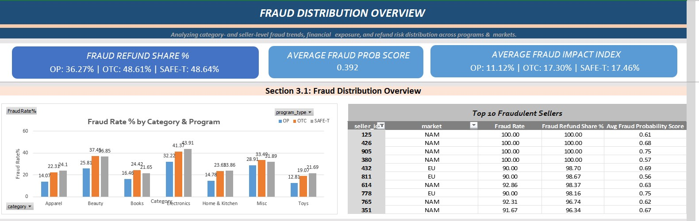

# Amazon Returns & Reimbursement Risk Analysis

### 📊 Overview
A data analytics project replicating Amazon’s **Returns & Reimbursement Risk Operations** to evaluate refund exposure, SLA performance, and fraud distribution across programs and markets.  
The project uses **SQL, pandas, and Excel dashboards** to transform, aggregate, and visualize key risk metrics across 11,000 synthetic cases.

---

### 🎯 Objectives
- Analyze program-level operational performance (OP, OTC, SAFE-T)
- Detect patterns in refund exposure and fraud probability
- Measure SLA breach rates and resolution efficiency
- Create a multi-tab Excel dashboard for KPI visualization

---

### 🧠 Tools & Workflow
**SQL:** CTE-based queries for fraud rate %, SLA breach %, and refund KPIs  
**Python (pandas, matplotlib):** Data processing, feature derivation, and export of clean CSVs  
**Excel Dashboard:** Interactive visualization across three analytical tabs:
1. **Overview Dashboard** – Summary KPIs (fraud %, SLA, handling time) by program and category  
2. **Operational Efficiency Dashboard** – SLA breach analysis by market and program, fraud vs. time correlation  
3. **Fraud Distribution Overview** – Category and seller-level fraud distribution, refund exposure, and risk tiers  

---

### 📈 Key Metrics
- **Total Cases:** 11,000  
- **Overall Fraud Rate:** 28.7%  
- **Average Handling Time:** 6.5 minutes  
- **Average Resolution Time:** 4.2 days  
- **SLA Breach (avg):** ~22%  
- **Average Refunds:** EU €25.3 | NAM $40.2  

---

### 🧾 Dashboard Previews

#### **Overview Dashboard**

#### **Operational Efficiency Dashboard**

#### **Fraud Distribution Overview**

---

### ⚙️ Technical Notes
- Synthetic dataset mimics refund case data from Amazon programs  
- All metrics computed using SQL-based logic and pandas transformations  
- Excel dashboard linked via exported CSVs (auto-refresh enabled)

---

### 🚀 Results & Application
This project replicates real-world **fraud analytics and risk reporting workflows** in Amazon operations, combining data engineering (SQL + pandas) with business intelligence (Excel dashboards).  
It demonstrates KPI automation, operational risk segmentation, and insight delivery for fraud prevention teams.

---

> **Disclaimer:** This project uses synthetic data and simulated workflows inspired by general industry processes.  

> It is not affiliated with, endorsed by, or sponsored by Amazon. I hold no rights to Amazon intellectual property.
