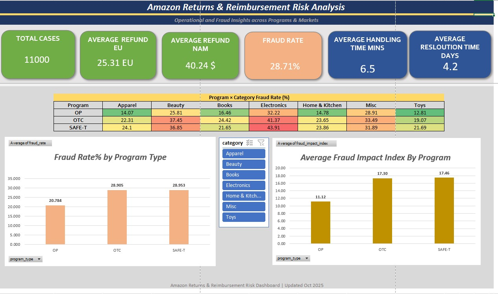
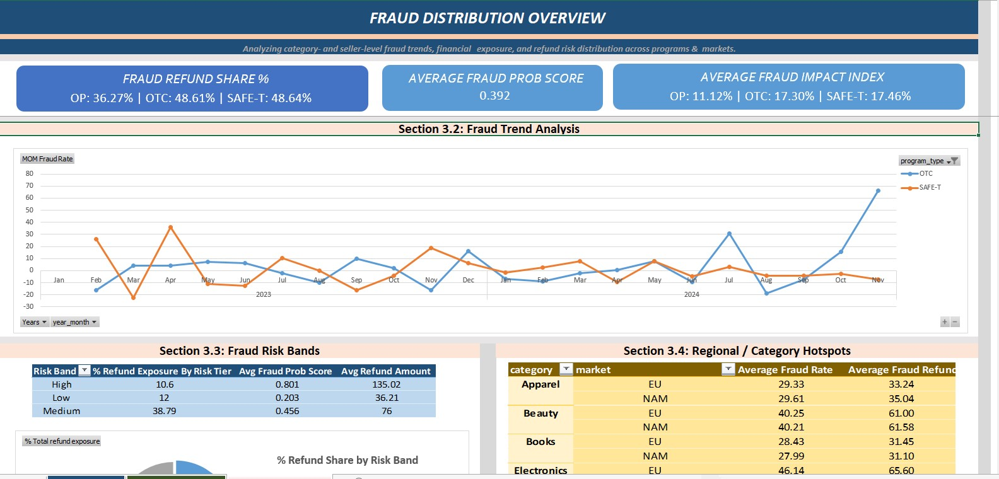

# E-Commerce Returns & Reimbursement Risk Analysis

### 📊 Overview
A data analytics project simulating large-scale **returns and reimbursement operations** in an e-commerce environment to evaluate refund exposure, SLA performance, and fraud distribution across programs and markets.  
The project uses **SQL, pandas, and Excel dashboards** to transform, aggregate, and visualize key operational and risk metrics across **11,000 synthetic refund cases**.

---

### 🎯 Objectives
- Analyze program-level operational performance across simulated programs (Returns, Customer Refund, Risk Review)  
- Detect patterns in refund exposure, fraudulent activity, and repeat claim behavior  
- Measure SLA breach rates, resolution efficiency, and refund handling time  
- Create a multi-tab Excel dashboard to visualize KPIs for operations, policy, and risk teams
  
---

### 🧠 Tools & Workflow
**SQL:** Query logic for fraud rate %, SLA breach %, refund exposure, and trend segmentation  
**Python (pandas, matplotlib):** Data processing, feature derivation, and CSV export for visualization  
**Excel Dashboard:** Interactive reporting with three analytical tabs:
1. **Overview Dashboard** – Summary KPIs (fraud %, SLA, handling time) by program and category  
2. **Operational Efficiency Dashboard** – SLA breach and resolution efficiency by region and program  
3. **Fraud Distribution Dashboard** – Category and seller-level fraud segmentation, refund exposure, and risk tiers  

---

### 📈 Key Metrics
- **Total Cases:** 11,000  
- **Overall Fraud Rate:** 28.7%  
- **Average Handling Time:** 6.5 minutes  
- **Average Resolution Time:** 4.2 days  
- **SLA Breach (avg):** ~22%  
- **Average Refunds:** EU €25.3 | NAM $40.2  

---

### 🧾 Dashboard Previews

#### **Overview Dashboard**

#### **Operational Efficiency Dashboard**

#### **Fraud Distribution Overview**

---

### ⚙️ Technical Notes
- Synthetic dataset mimics refund and return case patterns inspired by large-scale e-commerce operations  
- Program names (e.g., SAFE-T, OP, OTC) are used as illustrative placeholders for generic workflows  
- All metrics computed using SQL-based logic and pandas transformations  
- Excel dashboard linked via exported CSVs (auto-refresh enabled)
  
---

### 🚀 Results & Application
This project replicates **fraud analytics and risk reporting workflows** commonly found in large e-commerce reimbursement operations.  
It demonstrates the integration of **data engineering (SQL + pandas)** with **business intelligence (Excel dashboards)** to enable KPI automation, operational risk segmentation, and policy-impact tracking.

---

> **Disclaimer:**  
> This project uses synthetic data and simulated workflows inspired by real-world e-commerce reimbursement operations.  
> It is not affiliated with, endorsed by, or sponsored by Amazon.  
> All identifiers, program names, and claim types are illustrative and created solely for demonstration.

